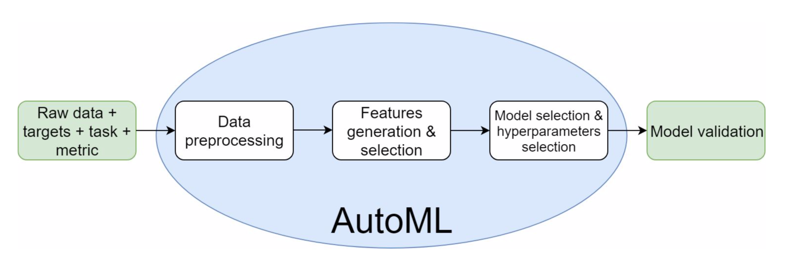

# NDSML Summit

## Take home messages

Organized by [hyperight](https://hyperight.com)

---

## Overview

* Venue: Stockholm
* Number of participants: ~300
* ~50 talks in 4 tracks

---

## Opening remarks and Panel

* Errol Koolmeister
* Anders Arpteg
* Daniel Tidström
* Robert Luciani

----

### Highlights

* Don't be afraid to start, even without ML
* The fanciest algorithm is useless without proper pipelines and flows
* Once founded, pick low hanging fruits and optimize

----

### Highlights (cont')

* Fail fast
* Setting the objective; what do you want to measure?
* Expectations management with stakeholders
* Break a project to chunks of 1-3 months

----

### Highlights (cont' 2)

----

### Highlights (cont' 3)

---

## The role of reproducibility
* Lars Albertsson
* and other speakers

----

### Highlights

* Master orchestration tools (like [`airflow`](https://airflow.apache.org))
* Everything is either a configuration or code
* Collaborate and learn from Eng. and DevOps

---

## DS/ML in businesses

* Victoria Chudinov
* Katharina Glass

----

### Highlights

* Can you do it w/o DS?
* Shadow data users
* Prefer raw data and hunt it
* Trying is the first step towards failing

---

## Auto ML

* Denis Vorotyntsev

----

---

## Federated Learning

  <!-- .element height="70%" width="70%" -->

---

## Predicting Wind Speeds with DL

* Hjalte V. Kiefer

----

DL using [Keras](https://keras.io/)
---

## Spark Workshop

* Jeff Fletcher

---

## To be explored

* [sk-dist](https://github.com/Ibotta/sk-dist)
* [airflow](https://github.com/apache/airflow)
* [tpot](https://epistasislab.github.io/tpot/)
